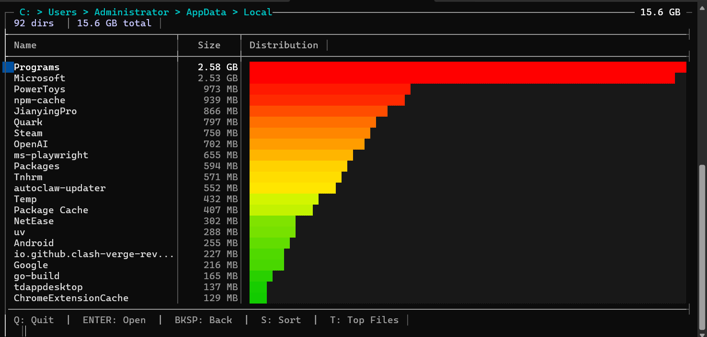

# SpaceMap

[**English**](./README_EN.md) | **中文**


**磁盘满了，不知道什么东西占了这么多空间？**

资源管理器只能看一个文件夹，WinDirStat 太重启动慢，du 命令没有颜色没有图表。

**SpaceMap** — 一个轻量、快速、好看的命令行磁盘分析工具。

运行截图：


GIF实机演示+食用方法：

<details><summary>点击展开 大小42MB 可能需要等待</summary>


</details>

## 快速开始

```bat
map              # 扫描当前目录
map -i           # 进入TUI交互模式（像 ncdu 一样浏览）
```

## 安装

**推荐方式**（全局可用）：

将 `map.exe` 复制到 `C:\Windows` 或其他环境变量的目录，之后在任何路径都能直接执行 `map`。

或选择 **自行编译**（需要 g++ 4.9+ / MinGW-w64 / Windows 10+）：

```bat
git clone https://github.com/usernameisnotavaliablee/spacemap.git
cd spacemap
build.bat
```

## 为什么选 SpaceMap？

||SpaceMap|WinDirStat|du (GNU)|
|-|-|-|-|
|启动速度|即时|慢（需扫描）|即时|
|颜色/图表|渐变 + █ 柱状图|有，但 GUI|无|
|交互模式|有（TUI）|有（GUI）|无|
|JSON 输出|有|无|无|
|命令行|原生|需要 GUI|原生|
|依赖|无（单文件 exe）|需安装|需安装|
|性能|多线程 + MFT 直读，2-5s/NTFS|慢|单线程|

## 用法

```
map [选项] [路径]
```

|选项|说明|
|-|-|
|`-i`|交互模式，方向键浏览目录|
|`-t N`|显示 Top N 最大文件（默认不显示）|
|`-a`|显示所有目录（读缓存，3分钟有效）|
|`-j`|JSON 格式输出|
|`-o FILE`|输出到文件|
|`-s name`|按名称排序（默认按大小）|
|`-v`|显示跳过/错误的目录详情|
|`-w N`|指定线程数（默认自动）|
|`--no-color`|禁用颜色|
|`-h`|显示帮助|

### TUI交互模式

```bat
map -i D:\
```
或者在当前目录下
```bat
map -i
```
得到



|按键|功能|
|-|-|
|`↑` `↓`|移动选择|
|`Enter`|进入目录|
|`Backspace`|返回上级|
|`S`|切换排序|
|`A`|显示/隐藏被折叠的小目录|
|`T`|查看当前目录最大文件（异步加载，不阻塞界面）|
|`Q`|退出|


## 跳过的目录

默认跳过：`$RECYCLE.BIN`、`System Volume Information`、`$WinREAgent`、`Recovery`、`PerfLogs`、所有 `.` 开头的隐藏目录。

用 `-v` 参数可查看具体跳过了哪些目录。


## 性能

实测数据（NVMe SSD，Windows 11）：

|目录大小|文件数|耗时|模式|
|-|-|-|-|
|2.2 GB|892|0.1s|普通扫描|
|106 GB (C:\)|65 万|~7s|MFT 直读|
|207 GB (D:\)|48 万|~15s|普通扫描|

NTFS 卷根目录自动走 MFT 快速路径（`FSCTL_ENUM_USN_DATA` + bulk read），其他路径走多线程递归扫描。

## 特性

- **24位渐变色** — 绿→黄→红，一眼看出大小分布
- **智能折叠** — 0B 目录始终隐藏，小目录按需折叠
- **自适应宽度** — 进度条和分隔线自动适配终端宽度
- **CJK 支持** — 中日韩文件名正确截断，不会撑乱表格
- **交互模式** — 像 ncdu 一样浏览目录，按 T 异步加载当前目录最大文件
- **JSON 导出** — 便于脚本处理，输出带 UTF-8 BOM，记事本可直接打开
- **命令提示** — 扫描完成后显示常用命令，方便快速上手
- **线程安全** — 原子操作保护并发读写，无数据竞争
- **优雅退出** — 超时机制防止卡死在慢速驱动器上
- **Ctrl+C 友好** — 任意时刻Ctrl+C即可随时中断
- **零依赖** — 单文件 exe，开箱即用


### JSON 输出

<details><summary>点击展开</summary>
```bat
map.exe -j -o report.json D:\
```

```json
{
  "path": "D:\",
  "scan_time_seconds": 3.2,
  "total": { "size": 275234832384, "size_human": "256.3 GB", "files": 189432 },
  "folders": [
    { "name": "Games", "size": 138000000000, "size_human": "128.5 GB", "percent": 50.1 }
  ],
  "file_types": [
    { "category": "Code", "size": 45412345678, "size_human": "42.3 GB", "count": 89234 }
  ]
}
```
</details>

使用`-t N` 显示最大的N个文件
比如：
```bat
map -t 10 D:\
```

显示所有目录（包括被折叠的，读缓存）：
```bat
map -a D:\
```

## 项目结构

```
spacemap/
├── types.h           数据结构
├── scanner.h/cpp     扫描引擎（Win32 API）
├── mft.h/cpp         MFT 直读（NTFS 卷快速扫描）
├── stats.h/cpp       文件类型分类
├── output.h/cpp      输出渲染
├── tui.h/cpp         交互模式
├── map.cpp           主程序
├── build.bat         编译脚本
├── CMakeLists.txt    CMake 构建
└── map.exe           编译成果 单文件直接运行
```

### 模块依赖

```
types.h  (无依赖)
  │
  ├── scanner.h/cpp  (依赖 types.h)
  ├── mft.h/cpp      (依赖 types.h, scanner.h)
  ├── stats.h/cpp    (依赖 types.h)
  ├── output.h/cpp   (依赖 types.h, scanner.h)
  └── tui.h/cpp      (依赖 types.h, scanner.h)
  │
map.cpp              (依赖所有模块)
```

### 核心数据结构

```cpp
// 扫描统计
struct ScanStats {
    long long size;              // 总大小（字节）
    unsigned long long files;    // 文件数
    unsigned long long dirs;     // 目录数
    unsigned long long skipped;  // 跳过的目录数
    unsigned long long errors;   // 错误数
};

// 目录条目（所有数值字段均为原子类型，支持线程安全的并发读写）
struct DirEntry {
    std::wstring name;
    std::atomic<long long> size;
    std::atomic<unsigned long long> files;
    std::atomic<unsigned long long> dirs;
};

// 扫描结果
struct ScanResult {
    ScanStats stats;
    std::vector<FileInfo> top_files;           // Top-N 最大文件
    std::map<std::string, long long> ext_sizes;  // 扩展名 → 大小
    std::map<std::string, unsigned long long> ext_counts; // 扩展名 → 数量
    std::vector<std::wstring> skipped_dirs;    // 跳过的目录路径（上限 1000）
    std::vector<std::wstring> error_dirs;      // 错误的目录路径（上限 1000）

    static const size_t MAX_LOGGED_DIRS = 1000; // 日志目录数上限，防止内存暴涨
};

// 命令行选项
struct CliOptions {
    int workers;             // 线程数
    int top_n;               // Top N 文件数
    std::string sort_mode;   // 排序方式
    bool json_output;        // JSON 输出
    bool interactive;        // 交互模式
    bool verbose;            // 显示详细信息
    bool no_color;           // 禁用颜色
    std::string output_file; // 输出文件
    std::wstring target_path; // 目标路径
};
```

## 技术细节

<details>
<summary>点击展开</summary>

### 1. 扩展名提取：避免全字符串转换

传统做法是把整个文件名转成 UTF-8 再找 `.`，但大多数文件名很长而扩展名很短。优化后直接在 `wchar_t` 中反向查找 `.`，只转换扩展名部分（通常 3-4 字节）：

```cpp
static std::string get_extension(const wchar_t* name) {
    const wchar_t* dot = NULL;
    for (const wchar_t* p = name; *p; p++) {
        if (*p == L'.') dot = p;  // 反向查找最后一个 .
    }
    if (!dot || dot == name) return "";

    // 快速路径：99.9% 的扩展名都是 ASCII
    if (all_ascii && len < 16) {
        char buf[16];
        for (int i = 0; i < len; i++) {
            char c = (char)dot[i];
            buf[i] = (c >= 'A' && c <= 'Z') ? c + 32 : c;  // 手动 tolower
        }
        return std::string(buf);
    }
    // 慢速路径：非 ASCII 扩展名（极少见）
    ...
}
```

**效果**：避免了每个文件都调用 `WideCharToMultiByte` 系统调用。

### 2. 文件类型分类

扫描时按扩展名自动归类，便于快速识别空间占用来源：

| 分类 | 扩展名示例 |
|------|-----------|
| Video | mp4, mkv, avi, mov, wmv, flv, webm |
| Image | jpg, png, gif, svg, webp, heic, avif |
| Audio | mp3, wav, flac, aac, ogg, wma |
| Document | pdf, doc, docx, xls, xlsx, ppt, txt, csv, log |
| Archive | zip, rar, 7z, tar, gz, iso, vmdk, vhd |
| Code | cpp, h, py, js, ts, java, go, rs, html, css, json, yaml |
| Executable | exe, dll, sys, msi, bat, cmd |
| Database | db, sqlite, mdb, accdb |
| Font | ttf, otf, woff, woff2 |
| Design | psd, ai, sketch, fig, xcf |
| Other | 未匹配以上分类的扩展名 |

### 3. Top-N 维护：插入排序 + 提前终止

维护一个大小为 N 的有序 vector，新文件只有比最小元素大时才插入：

```cpp
if ((int)result.top_files.size() < top_n) {
    // 未满：直接追加，满时才排序一次
    result.top_files.push_back(fi);
    if ((int)result.top_files.size() == top_n)
        std::sort(result.top_files.begin(), result.top_files.end(),
                  [](const FileInfo& a, const FileInfo& b) { return a.size > b.size; });
} else if (fsize > result.top_files.back().size) {
    // 已满：替换最小元素，向上冒泡
    result.top_files.back() = fi;
    for (int i = (int)result.top_files.size() - 1; i > 0; i--) {
        if (result.top_files[i].size > result.top_files[i-1].size)
            std::swap(result.top_files[i], result.top_files[i-1]);
        else break;  // 提前终止
    }
}
```

**复杂度**：O(1) 判断 + O(N) 最坏冒泡，实际几乎总是 O(1)。

### 4. 无锁任务分发

工作线程通过 `atomic<int>` 自增获取任务索引，无锁竞争：

```cpp
std::atomic<int> next_index(0);

// 工作线程
for (;;) {
    int i = next_index.fetch_add(1);  // 原子自增，返回旧值
    if (i >= total_count) break;
    results[i] = get_dir_size(dir_paths[i], top_n);
    prog.done_count.fetch_add(1);
    prog.bytes_so_far.fetch_add(result.stats.size);
}
```

**优势**：比 mutex 队列更轻量，适合任务粒度大的场景。

### 5. RGB 渐变色算法

使用 24 位真彩色（`\x1b[38;2;R;G;Bm`）实现三段渐变：

```cpp
int r, g;
long long mb = bytes / (1024 * 1024);

if (mb <= 100) {
    r = 0; g = 200;                              // 纯绿
} else if (mb <= 500) {
    double t = (double)(mb - 100) / 400.0;
    r = (int)(255 * t);                           // 绿→黄
    g = 200 + (int)(55 * t);
} else if (mb <= 1024) {
    double t = (double)(mb - 500) / 524.0;
    r = 255; g = 255 - (int)(255 * t);            // 黄→红
} else {
    r = 255; g = 0;                               // 纯红
}
```

### 6. 智能折叠决策

0B 目录始终隐藏；此外，当 >=40% 的子目录 >5MB 时，隐藏所有小目录以减少噪音：

```cpp
// Always hide 0B folders; additionally hide <5MB if threshold met
if (fsize == 0 || (hide_small && fsize < threshold)) {
    small_folders.push_back(folders[i]);
}
```

**设计决策**：
- 0B 目录：空目录或无权限目录，始终隐藏
- 阈值 40%：近半目录大时就折叠，减少噪音
- 最少 3 个目录：2 个目录时折叠没意义

### 7. 迭代式 DFS（非递归）

用 `std::vector` 模拟栈，避免深层目录递归导致栈溢出：

```cpp
std::vector<std::wstring> stack;
stack.reserve(256);  // 预分配
stack.push_back(root);

while (!stack.empty()) {
    std::wstring dir = std::move(stack.back());
    stack.pop_back();
    // ... 遍历子目录，push_back 新目录
}
```

### 8. 进度条动画

主线程每 100ms 刷新进度，使用 `\x1b[2K\r` 清除整行后重写：

```cpp
while (prog.done_count.load() < total_count && !g_interrupted.load()) {
    update_progress(prog, std::cout, ansi);
    std::this_thread::sleep_for(std::chrono::milliseconds(100));
}
```

进度条格式：`[██████►       ] 42/100  3.2 GB`

### 9. 线程安全：原子 DirEntry

TUI 中扫描线程写 `DirEntry` 的 `size`/`files`/`dirs`，渲染线程读同一字段。全部使用 `std::atomic` + `memory_order_relaxed` 保证无数据竞争：

```cpp
struct DirEntry {
    std::wstring name;
    std::atomic<long long> size;
    std::atomic<unsigned long long> files;
    std::atomic<unsigned long long> dirs;
};

// 扫描线程写
state.entries[j].size.store(scan_result.stats.size, std::memory_order_relaxed);

// 渲染线程读
long long e_size = e.size.load(std::memory_order_relaxed);
```

**设计决策**：用 `relaxed` 而非 `seq_cst`，因为读写不需要全局顺序一致，只需要值本身原子。x86 上 aligned 64-bit load/store 天然原子，`relaxed` 零开销。`scan_cache`（`std::map`）的并发访问通过 `std::mutex` 保护。

### 10. 原子渲染：WriteConsoleOutputW

TUI 使用 `WriteConsoleOutputW` 一次写入字符+属性，避免两次调用之间的闪烁：

```cpp
std::vector<CHAR_INFO> ci(w * h);
for (int i = 0; i < w * h; i++) {
    ci[i].Char.UnicodeChar = chars[i];
    ci[i].Attributes = attrs[i];
}
COORD buf_size = {(SHORT)w, (SHORT)h};
SMALL_RECT region = {0, 0, (SHORT)(w - 1), (SHORT)(h - 1)};
WriteConsoleOutputW(g_tui_buffer, ci.data(), buf_size, {0,0}, &region);
```

### 11. CJK 宽字符截断

中日韩字符在终端占 2 列，普通 `string::size()` 无法反映实际宽度。TUI 和文本报告都做了 CJK 感知截断：

```cpp
// 计算显示宽度（CJK 字符算 2 列）
int dw = 0;
for (size_t i = 0; i < name.size(); i++) {
    wchar_t ch = name[i];
    dw += (ch >= 0x4E00 && ch <= 0x9FFF) ||  // CJK Unified
          (ch >= 0x3000 && ch <= 0x30FF) ||  // CJK Symbols
          (ch >= 0xFF00 && ch <= 0xFFEF) ||  // Fullwidth
          (ch >= 0xAC00 && ch <= 0xD7AF) ? 2 : 1;  // Hangul
}
```

### 12. 线程超时退出

扫描线程可能卡在慢速网络驱动器或断开的 USB 设备上。析构函数和目录切换时使用 `WaitForSingleObject` 超时机制：

```cpp
static void join_with_timeout(std::thread& t, DWORD timeout_ms) {
    if (!t.joinable()) return;
    HANDLE h = (HANDLE)t.native_handle();
    if (WaitForSingleObject(h, timeout_ms) == WAIT_TIMEOUT) {
        t.detach();  // 超时则 detach，避免程序卡死
    } else {
        t.join();
    }
}
```

**超时值**：目录切换 5s，程序退出 3s。

### 13. 自适应终端宽度

文本报告的柱状图宽度和分隔线宽度根据终端实际宽度动态计算：

```cpp
CONSOLE_SCREEN_BUFFER_INFO info;
GetConsoleScreenBufferInfo(hOut, &info);
int console_w = info.srWindow.Right - info.srWindow.Left + 1;
int bar_max = console_w - name_w - 22;  // 减去名称列、大小列、百分比、间距
bar_max = std::min(60, std::max(10, bar_max));
```

### 14. MFT 直读：NTFS 极速扫描

扫描 NTFS 卷上的任意目录时，自动启用 MFT 快速路径，跳过递归目录遍历。扫描在后台线程执行，UI 保持响应。

**原理**：NTFS 的 MFT（Master File Table）记录了卷上所有文件的元数据。三阶段流程：

1. **枚举** — `FSCTL_ENUM_USN_DATA` 获取所有文件/目录的 ref + parent_ref + 名称 + 属性
2. **取大小** — 读取 MFT 记录的 `$DATA` 属性，获取 logical size（非 allocated size）
3. **建树** — 沿 parent chain 构建目录树，累加每个目录的递归大小和文件数

```cpp
// 1. 枚举所有 MFT 条目（USN journal）
DeviceIoControl(vol, FSCTL_ENUM_USN_DATA, &med, ...);
// → file_ref & 0x0000FFFFFFFFFFFF（去掉 sequence number）

// 2. 读取文件大小（混合策略）
if (mft_size <= 512MB) {
    // Bulk read：顺序读整个 MFT 文件（HDD 友好）
    ReadFile(vol, chunk_buf, 1MB, ...);
} else {
    // 逐条读：随机 1KB 读取（SSD 已够快）
    ReadFile(vol, rec_buf, 1024, ...);
}
// 解析 $DATA attribute → data_size（logical size，和 FindFirstFile 一致）

// 3. 沿 parent chain 累加
while (parent >= 0) {
    dir_sizes[parent] += file_size;   // 递归大小
    dir_files[parent]++;              // 递归文件数
    parent = dir_parent[parent];
}
```

**MinGW 兼容**：MinGW 的 `winioctl.h` 缺少 USN 相关结构定义，手动声明 `MFT_ENUM_DATA_V0`、`USN_RECORD_V2` 及相关控制码。`NTFS_VOLUME_DATA_BUFFER` 已有定义，直接使用。

**性能**：NVMe SSD 上约 2-5s（65 万文件），后台线程执行不阻塞 UI。HDD 上 bulk read 策略避免随机 I/O，速度优势明显。结果缓存在 `scan_cache` 中，导航到子目录时如果已有缓存则瞬间显示。

**适用范围**：NTFS 卷上的任意目录均可使用 MFT 快速路径。若 MFT 读取失败（权限不足等），自动回退到普通多线程遍历。

### 15. TUI 渲染优化

- **预计算 VT 转义序列**：常用颜色（边框、文字、高亮、选中背景等）在编译期定义为 `static const std::wstring`，避免每帧重复拼接 `\x1b[38;2;R;G;Bm` 字符串。仅渐变色柱状图保留动态计算。
- **O(1) 缓存查找**：`scan_cache`、`folder_map` 等使用 `std::unordered_map` 替代 `std::map`，目录导航时查找从 O(log n) 降为 O(1)。
- **逐行差分刷新**：VT 渲染路径维护 `prev_lines` 缓冲，仅重绘变化的行，减少终端 I/O。

</details>

## 兼容性

### 终端颜色支持

| 终端 | ANSI 支持 | 预期行为 |
|------|----------|----------|
| Windows Terminal | ✓ | 完整颜色 + Unicode |
| PowerShell 7+ | ✓ | 完整颜色 + Unicode |
| cmd.exe (Win10 1511+) | ✓ | 完整颜色 + Unicode |
| cmd.exe (旧版 Win10) | ✗ | 纯文本，`#` 号柱状图 |
| VS Code 终端 | ✓ | 完整颜色 + Unicode |

### 编译器兼容性

代码兼容 C++11，不使用以下特性：

- `std::filesystem` (C++17)
- `std::optional` (C++17)
- 结构化绑定 (C++17)
- `if constexpr` (C++17)
- `std::make_unique` (C++14)
- 泛型 lambda (C++14)

## 许可证

MIT License

