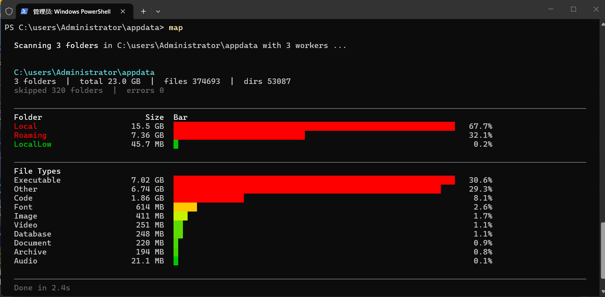

# SpaceMap

[English](./README_EN.md) | [**中文**](./README.md)


**Disk full, but no idea what's eating all that space?**

Explorer only shows one folder at a time, WinDirStat is bloated and slow to start, and `du` has no colors or charts.

**SpaceMap** — a lightweight, fast, and good-looking command-line disk analyzer for Windows.

Screenshot:



GIF demo + usage:

<details><summary>Click to expand (42 MB, may take a moment)</summary>


</details>

```bat
map.exe D:\
```

```
  D:\
  12 folders  |  total 256.3 GB  |  files 189432  |  dirs 23891

  ──────────────────────────────────────────────────────────────
  Folder                      Size  Bar
  Games                    128.5 GB  ████████████████████████████████████████   50.1%
  Projects                  45.2 GB  ████████████████                          17.6%
  Documents                 32.1 GB  ███████████                               12.5%
  Videos                    28.8 GB  ██████████                                11.2%
  3 folders hidden (2.1 MB)

  ──────────────────────────────────────────────────────────────
  File Types
  Other                    156.2 GB  ████████████████████████████████████████   60.9%
  Code                      42.3 GB  ███████████                               16.5%
  Document                  35.1 GB  █████████                                 13.7%

  ──────────────────────────────────────────────────────────────
  Done in 3.2s

  -h help  -i interactive  -t N top files  -a show all folders
```

## Quick Start

```bat
map              # Scan current directory
map -i           # Interactive mode (browse like ncdu)
```

## Installation

**Recommended** (globally accessible):

Copy `map.exe` to `C:\Windows` or any directory in your PATH. Then run `map` from anywhere.

Or **build from source** (requires g++ 4.9+ / MinGW-w64 / Windows 10+):

```bat
git clone https://github.com/usernameisnotavaliablee/spacemap.git
cd spacemap
build.bat
```

## Why SpaceMap?

||SpaceMap|WinDirStat|du (GNU)|
|-|-|-|-|
|Startup|Instant|Slow (scans first)|Instant|
|Colors/Charts|Gradient + █ bars|Yes, but GUI|None|
|Interactive|Yes (TUI)|Yes (GUI)|None|
|CLI-native|Yes|Needs GUI|Yes|
|Dependencies|None (single exe)|Requires install|Requires install|
|Performance|Multi-threaded + MFT direct read, 2-5s/NTFS|Slow|Single-threaded|

## Usage

```
map.exe [options] [path]
```

|Option|Description|
|-|-|
|`-i`|Interactive mode, navigate with arrow keys|
|`-t N`|Show Top N largest files (hidden by default)|
|`-a`|Show all directories (uses cache, valid for 3 minutes)|
|`-o FILE`|Write output to file|
|`-s name`|Sort by name (default: sort by size)|
|`-v`|Show skipped/errored directory details|
|`-w N`|Thread count (default: auto)|
|`--no-color`|Disable colors|
|`-h`|Show help|

### Interactive Mode

```bat
map.exe -i D:\
```

```
 D:\
────────────────────────────────────────────────────────────────
  Name                    Size       Bar
────────────────────────────────────────────────────────────────
    Games                 128.5 GB   ██████████████████████████
    Projects               45.2 GB   ████████████████           ← selected
    Documents              32.1 GB   ███████████
────────────────────────────────────────────────────────────────
 \[Q]uit  \[Enter]Open  \[Back]Up  \[S]ort  \[A]ll  \[T]op Files
────────────────────────────────────────────────────────────────
```

|Key|Action|
|-|-|
|`↑` `↓`|Move selection|
|`Enter`|Open directory|
|`Backspace`|Go up|
|`S`|Toggle sort order|
|`A`|Show/hide collapsed small directories|
|`T`|View largest files in current directory (async, non-blocking)|
|`Q`|Quit|

Show Top 10 largest files:
```bat
map.exe -t 10 D:\
```

Show all directories (including collapsed ones, reads from cache):
```bat
map.exe -a D:\
```

## Performance

Benchmarks (NVMe SSD, Windows 11):

|Directory Size|Files|Time|Mode|
|-|-|-|-|
|2.2 GB|892|0.1s|Normal scan|
|106 GB (C:\)|650K|~7s|MFT direct read|
|207 GB (D:\)|480K|~15s|Normal scan|

NTFS volume root directories automatically use the MFT fast path (`FSCTL_ENUM_USN_DATA` + bulk read). Other paths fall back to multi-threaded recursive scanning.

## Features

- **24-bit gradient colors** — Green → Yellow → Red, size distribution at a glance
- **Smart collapsing** — 0B directories always hidden, small directories folded on demand
- **Adaptive width** — Progress bars and separators auto-fit terminal width
- **CJK support** — Chinese/Japanese/Korean filenames truncate correctly without breaking layout
- **Interactive mode** — Browse directories like ncdu, press T to async-load largest files
- **Scan tips** — While scanning, rotating tips appear next to the progress bar: usage flags, disk trivia, and dad jokes
- **Command hints** — Shows useful commands after scan completion
- **Thread-safe** — Atomic operations protect concurrent reads/writes, no data races
- **Graceful exit** — Timeout mechanisms prevent hangs on slow drives
- **Ctrl+C friendly** — Interrupt anytime
- **Zero dependencies** — Single-file exe, works out of the box

## Project Structure

```
spacemap/
├── types.h           Data structures
├── scanner.h/cpp     Scan engine (Win32 API)
├── mft.h/cpp         MFT direct read (NTFS fast scan)
├── stats.h/cpp       File type classification
├── output.h/cpp      Output rendering
├── tui.h/cpp         Interactive mode
├── tips.h/cpp        Scan-wait tips (usage / trivia / jokes)
├── map.cpp           Main entry point
├── build.bat         Build script
├── CMakeLists.txt    CMake build
└── map.exe           Pre-built binary, ready to run
```

### Module Dependencies

```
types.h  (no dependencies)
  │
  ├── scanner.h/cpp  (depends on types.h)
  ├── mft.h/cpp      (depends on types.h, scanner.h)
  ├── stats.h/cpp    (depends on types.h)
  ├── output.h/cpp   (depends on types.h, scanner.h)
  └── tui.h/cpp      (depends on types.h, scanner.h)
  │
map.cpp              (depends on all modules)
```

### Core Data Structures

```cpp
// Scan statistics
struct ScanStats {
    long long size;              // Total size (bytes)
    unsigned long long files;    // File count
    unsigned long long dirs;     // Directory count
    unsigned long long skipped;  // Skipped directories
    unsigned long long errors;   // Error count
};

// Directory entry (all numeric fields are atomic for thread-safe concurrent access)
struct DirEntry {
    std::wstring name;
    std::atomic<long long> size;
    std::atomic<unsigned long long> files;
    std::atomic<unsigned long long> dirs;
};

// Scan result
struct ScanResult {
    ScanStats stats;
    std::vector<FileInfo> top_files;           // Top-N largest files
    std::map<std::string, long long> ext_sizes;  // Extension → size
    std::map<std::string, unsigned long long> ext_counts; // Extension → count
    std::vector<std::wstring> skipped_dirs;    // Skipped paths (capped at 1000)
    std::vector<std::wstring> error_dirs;      // Error paths (capped at 1000)

    static const size_t MAX_LOGGED_DIRS = 1000; // Log cap to prevent memory blowup
};

// CLI options
struct CliOptions {
    int workers;             // Thread count
    int top_n;               // Top N file count
    std::string sort_mode;   // Sort mode
    bool interactive;        // Interactive mode
    bool verbose;            // Verbose output
    bool no_color;           // Disable colors
    std::string output_file; // Output file
    std::wstring target_path; // Target path
};
```

## Technical Details

<details>
<summary>Click to expand</summary>

### 1. Extension Extraction: Avoid Full String Conversion

Traditional approaches convert the entire filename to UTF-8 before finding `.`, but most filenames are long while extensions are short. The optimized version scans backward for `.` directly in `wchar_t` and only converts the extension (typically 3-4 bytes):

```cpp
static std::string get_extension(const wchar_t* name) {
    const wchar_t* dot = NULL;
    for (const wchar_t* p = name; *p; p++) {
        if (*p == L'.') dot = p;  // Find last '.'
    }
    if (!dot || dot == name) return "";

    // Fast path: 99.9% of extensions are ASCII
    if (all_ascii && len < 16) {
        char buf[16];
        for (int i = 0; i < len; i++) {
            char c = (char)dot[i];
            buf[i] = (c >= 'A' && c <= 'Z') ? c + 32 : c;  // Manual tolower
        }
        return std::string(buf);
    }
    // Slow path: non-ASCII extensions (extremely rare)
    ...
}
```

**Effect**: Eliminates a `WideCharToMultiByte` system call per file.

### 2. File Type Classification

Files are automatically categorized by extension during scanning for quick identification of space usage:

| Category | Example Extensions |
|------|-----------|
| Video | mp4, mkv, avi, mov, wmv, flv, webm |
| Image | jpg, png, gif, svg, webp, heic, avif |
| Audio | mp3, wav, flac, aac, ogg, wma |
| Document | pdf, doc, docx, xls, xlsx, ppt, txt, csv, log |
| Archive | zip, rar, 7z, tar, gz, iso, vmdk, vhd |
| Code | cpp, h, py, js, ts, java, go, rs, html, css, json, yaml |
| Executable | exe, dll, sys, msi, bat, cmd |
| Database | db, sqlite, mdb, accdb |
| Font | ttf, otf, woff, woff2 |
| Design | psd, ai, sketch, fig, xcf |
| Other | Anything not matching the above |

### 3. Top-N Maintenance: Insertion Sort + Early Termination

Maintains a sorted vector of size N. New files are only inserted when larger than the smallest element:

```cpp
if ((int)result.top_files.size() < top_n) {
    // Not full: append, sort once when full
    result.top_files.push_back(fi);
    if ((int)result.top_files.size() == top_n)
        std::sort(result.top_files.begin(), result.top_files.end(),
                  [](const FileInfo& a, const FileInfo& b) { return a.size > b.size; });
} else if (fsize > result.top_files.back().size) {
    // Full: replace smallest, bubble up
    result.top_files.back() = fi;
    for (int i = (int)result.top_files.size() - 1; i > 0; i--) {
        if (result.top_files[i].size > result.top_files[i-1].size)
            std::swap(result.top_files[i], result.top_files[i-1]);
        else break;  // Early termination
    }
}
```

**Complexity**: O(1) check + O(N) worst-case bubble, practically always O(1).

### 4. Lock-Free Task Distribution

Worker threads fetch task indices via `atomic<int>` increment — no lock contention:

```cpp
std::atomic<int> next_index(0);

// Worker thread
for (;;) {
    int i = next_index.fetch_add(1);  // Atomic increment, returns old value
    if (i >= total_count) break;
    results[i] = get_dir_size(dir_paths[i], top_n);
    prog.done_count.fetch_add(1);
    prog.bytes_so_far.fetch_add(result.stats.size);
}
```

**Advantage**: Lighter than a mutex-queue, ideal for coarse-grained tasks.

### 5. RGB Gradient Color Algorithm

Uses 24-bit true color (`\x1b[38;2;R;G;Bm`) with a three-stage gradient:

```cpp
int r, g;
long long mb = bytes / (1024 * 1024);

if (mb <= 100) {
    r = 0; g = 200;                              // Pure green
} else if (mb <= 500) {
    double t = (double)(mb - 100) / 400.0;
    r = (int)(255 * t);                           // Green → Yellow
    g = 200 + (int)(55 * t);
} else if (mb <= 1024) {
    double t = (double)(mb - 500) / 524.0;
    r = 255; g = 255 - (int)(255 * t);            // Yellow → Red
} else {
    r = 255; g = 0;                               // Pure red
}
```

### 6. Smart Collapsing Decision

0B directories are always hidden. Additionally, when >=40% of subdirectories are >5MB, all small directories are hidden to reduce noise:

```cpp
// Always hide 0B folders; additionally hide <5MB if threshold met
if (fsize == 0 || (hide_small && fsize < threshold)) {
    small_folders.push_back(folders[i]);
}
```

**Design decisions**:
- 0B directories: empty or permission-denied, always hidden
- 40% threshold: collapse when nearly half the dirs are large
- Minimum 3 directories: collapsing 2 directories is pointless

### 7. Iterative DFS (No Recursion)

Uses `std::vector` as a stack to avoid stack overflow from deep directory recursion:

```cpp
std::vector<std::wstring> stack;
stack.reserve(256);  // Pre-allocate
stack.push_back(root);

while (!stack.empty()) {
    std::wstring dir = std::move(stack.back());
    stack.pop_back();
    // ... enumerate children, push_back new directories
}
```

### 8. Progress Bar Animation

Main thread refreshes progress every 100ms using `\x1b[2K\r` to clear and rewrite the line:

```cpp
while (prog.done_count.load() < total_count && !g_interrupted.load()) {
    update_progress(prog, std::cout, ansi);
    std::this_thread::sleep_for(std::chrono::milliseconds(100));
}
```

Format: `[██████►       ] 42/100  3.2 GB`

### 9. Thread Safety: Atomic DirEntry

In TUI mode, the scan thread writes `DirEntry`'s `size`/`files`/`dirs` while the render thread reads the same fields. All use `std::atomic` + `memory_order_relaxed`:

```cpp
struct DirEntry {
    std::wstring name;
    std::atomic<long long> size;
    std::atomic<unsigned long long> files;
    std::atomic<unsigned long long> dirs;
};

// Scan thread writes
state.entries[j].size.store(scan_result.stats.size, std::memory_order_relaxed);

// Render thread reads
long long e_size = e.size.load(std::memory_order_relaxed);
```

**Design rationale**: `relaxed` instead of `seq_cst` because reads/writes don't need global ordering — just atomicity. On x86, aligned 64-bit load/store is naturally atomic, so `relaxed` is zero-cost. `scan_cache` (`std::map`) access is protected by `std::mutex`.

### 10. Atomic Rendering: WriteConsoleOutputW

TUI uses `WriteConsoleOutputW` to write characters and attributes in a single call, eliminating flicker between separate writes:

```cpp
std::vector<CHAR_INFO> ci(w * h);
for (int i = 0; i < w * h; i++) {
    ci[i].Char.UnicodeChar = chars[i];
    ci[i].Attributes = attrs[i];
}
COORD buf_size = {(SHORT)w, (SHORT)h};
SMALL_RECT region = {0, 0, (SHORT)(w - 1), (SHORT)(h - 1)};
WriteConsoleOutputW(g_tui_buffer, ci.data(), buf_size, {0,0}, &region);
```

### 11. CJK Wide Character Truncation

CJK characters occupy 2 columns in the terminal. Plain `string::size()` can't reflect actual display width. Both TUI and text reports handle CJK-aware truncation:

```cpp
// Calculate display width (CJK = 2 columns)
int dw = 0;
for (size_t i = 0; i < name.size(); i++) {
    wchar_t ch = name[i];
    dw += (ch >= 0x4E00 && ch <= 0x9FFF) ||  // CJK Unified
          (ch >= 0x3000 && ch <= 0x30FF) ||  // CJK Symbols
          (ch >= 0xFF00 && ch <= 0xFFEF) ||  // Fullwidth
          (ch >= 0xAC00 && ch <= 0xD7AF) ? 2 : 1;  // Hangul
}
```

### 12. Thread Timeout Exit

Scan threads may hang on slow network drives or disconnected USB devices. Destructors and directory switching use `WaitForSingleObject` with timeouts:

```cpp
static void join_with_timeout(std::thread& t, DWORD timeout_ms) {
    if (!t.joinable()) return;
    HANDLE h = (HANDLE)t.native_handle();
    if (WaitForSingleObject(h, timeout_ms) == WAIT_TIMEOUT) {
        t.detach();  // Timeout: detach to avoid deadlock
    } else {
        t.join();
    }
}
```

**Timeouts**: 5s for directory switching, 3s for program exit.

### 13. Adaptive Terminal Width

Text report bar widths and separator lengths dynamically adapt to actual terminal width:

```cpp
CONSOLE_SCREEN_BUFFER_INFO info;
GetConsoleScreenBufferInfo(hOut, &info);
int console_w = info.srWindow.Right - info.srWindow.Left + 1;
int bar_max = console_w - name_w - 22;  // Subtract name, size, percentage, spacing
bar_max = std::min(60, std::max(10, bar_max));
```

### 14. MFT Direct Read: NTFS Fast Scan

When scanning any directory on an NTFS volume, the MFT fast path is automatically enabled, bypassing recursive directory traversal. Scanning runs in a background thread, keeping the UI responsive.

**How it works**: NTFS's MFT (Master File Table) records metadata for all files on the volume. Three-stage pipeline:

1. **Enumerate** — `FSCTL_ENUM_USN_DATA` retrieves all file/directory refs + parent refs + names + attributes
2. **Read sizes** — Read the `$DATA` attribute from MFT records to get logical size (not allocated size)
3. **Build tree** — Walk parent chains to build the directory tree, accumulating recursive sizes and file counts

```cpp
// 1. Enumerate all MFT entries (USN journal)
DeviceIoControl(vol, FSCTL_ENUM_USN_DATA, &med, ...);
// → file_ref & 0x0000FFFFFFFFFFFF (strip sequence number)

// 2. Read file sizes (hybrid strategy)
if (mft_size <= 512MB) {
    // Bulk read: sequential read of entire MFT file (HDD-friendly)
    ReadFile(vol, chunk_buf, 1MB, ...);
} else {
    // Per-record: random 1KB reads (SSD is fast enough)
    ReadFile(vol, rec_buf, 1024, ...);
}
// Parse $DATA attribute → data_size (logical size, matches FindFirstFile)

// 3. Accumulate along parent chain
while (parent >= 0) {
    dir_sizes[parent] += file_size;   // Recursive size
    dir_files[parent]++;              // Recursive file count
    parent = dir_parent[parent];
}
```

**MinGW compatibility**: MinGW's `winioctl.h` lacks USN-related struct definitions. `MFT_ENUM_DATA_V0`, `USN_RECORD_V2`, and related control codes are manually declared. `NTFS_VOLUME_DATA_BUFFER` has existing definitions and is used directly.

**Performance**: ~2-5s on NVMe SSD (650K files), runs in background without blocking UI. On HDD, the bulk read strategy avoids random I/O, providing significant speedup. Results are cached in `scan_cache`; navigating to subdirectories with cached results displays instantly.

**Scope**: Any directory on an NTFS volume uses the MFT fast path. If MFT reading fails (e.g., insufficient permissions), it automatically falls back to normal multi-threaded traversal.

### 15. TUI Rendering Optimization

- **Pre-computed VT escape sequences**: Common colors (borders, text, highlight, selection background) are defined as `static const std::wstring` at compile time, avoiding repeated `\x1b[38;2;R;G;Bm` string assembly per frame. Only gradient bar colors are computed dynamically.
- **O(1) cache lookup**: `scan_cache`, `folder_map`, etc. use `std::unordered_map` instead of `std::map`, reducing directory navigation lookup from O(log n) to O(1).
- **Line-diff rendering**: The VT rendering path maintains a `prev_lines` buffer, only repainting changed lines to reduce terminal I/O.

</details>

## Skipped Directories

Skipped by default: `$RECYCLE.BIN`, `System Volume Information`, `$WinREAgent`, `Recovery`, `PerfLogs`, and reparse points (symlinks/junctions).

Note: `.`-prefixed folders (e.g. `.cache`, `.git`, `.gradle`) are normal directories on Windows and are scanned and counted normally.

Use `-v` to see which directories were skipped.

## Compatibility

### Terminal Color Support

| Terminal | ANSI Support | Expected Behavior |
|------|----------|----------|
| Windows Terminal | ✓ | Full color + Unicode |
| PowerShell 7+ | ✓ | Full color + Unicode |
| cmd.exe (Win10 1511+) | ✓ | Full color + Unicode |
| cmd.exe (older Win10) | ✗ | Plain text, `#` bars |
| VS Code Terminal | ✓ | Full color + Unicode |

### Compiler Compatibility

Compatible with C++11. Does NOT use:

- `std::filesystem` (C++17)
- `std::optional` (C++17)
- Structured bindings (C++17)
- `if constexpr` (C++17)
- `std::make_unique` (C++14)
- Generic lambdas (C++14)

## License

MIT License
